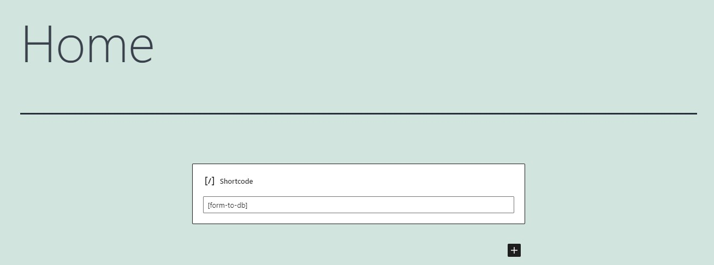
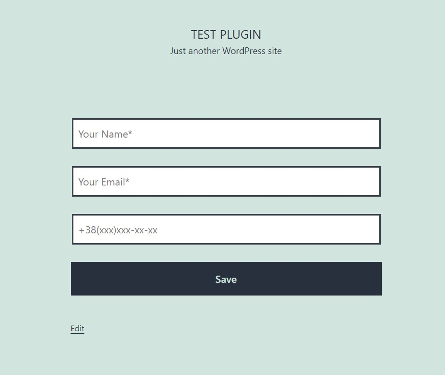
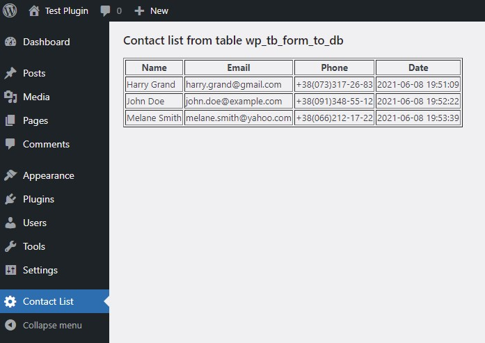
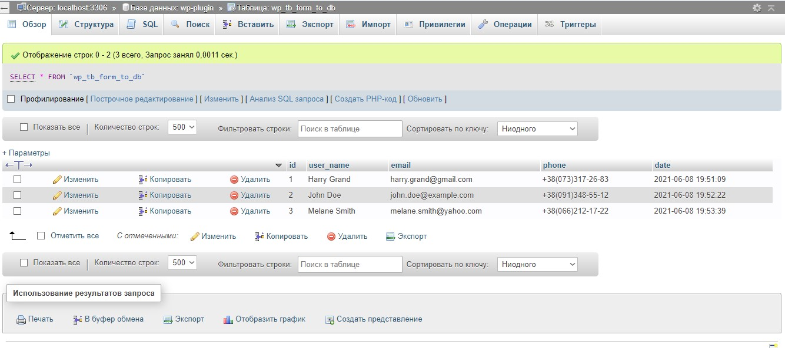

# Plugin 'Form to DB'
## Features:
1. Contains the shortcode [form-to-db]  to save a user contact to the table 'wp_tb_form_to_db'
2. Displays 'Contact List' on dashboard menu

-- Insert the shotcode[form-to-db] ---

-- Fronend Form ---

-- Contact List on Dashboard ---

--- Table 'wp_tb_form_to_db' ---

